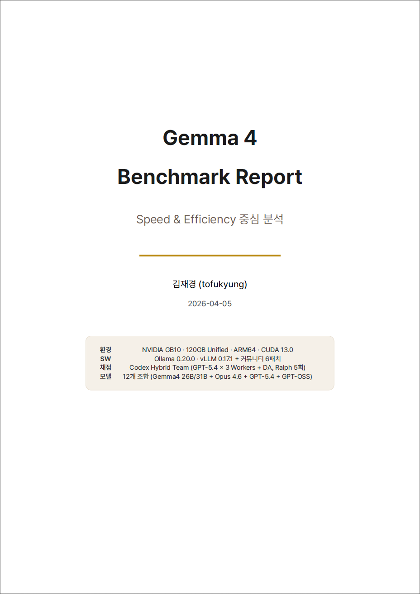
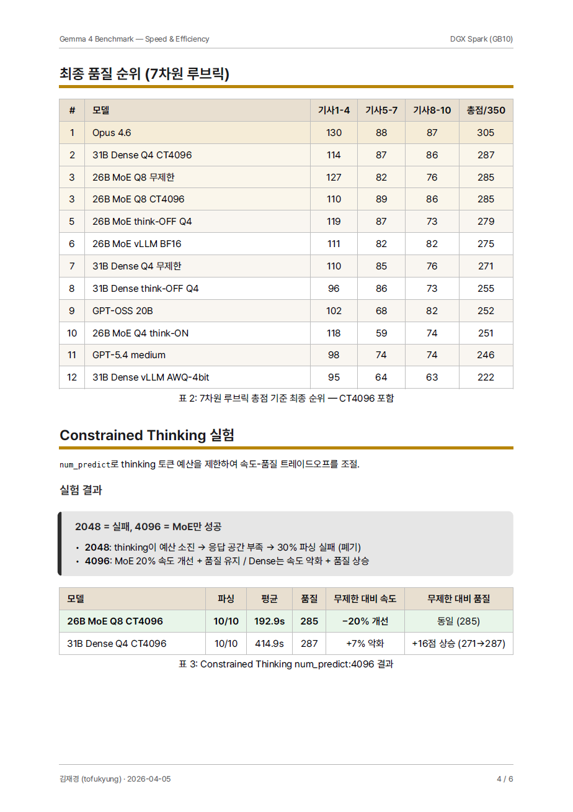
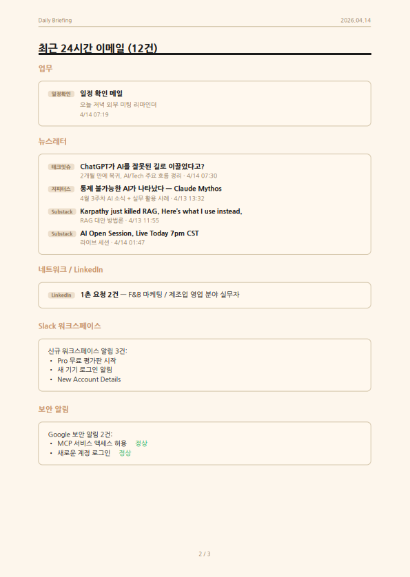

# typst-korean-report

> 한국어 보고서를 아름답게 만들어주는 Typst 템플릿입니다.
> Claude Code와 연동하면, "보고서 만들어줘" 한마디로 PDF가 자동 생성됩니다.

## 이런 보고서를 만들 수 있어요

| | | |
|:---:|:---:|:---:|
|  |  |  |

## Typst가 뭔가요?

[Typst](https://typst.app)는 LaTeX을 대체하는 현대적인 문서 작성 도구입니다.

- LaTeX보다 **문법이 훨씬 쉽고**
- 컴파일이 **즉시** 끝나고 (수백 페이지도 1초 이내)
- **한국어를 잘 지원**합니다

이 레포는 Typst로 한국어 보고서를 예쁘게 만들기 위한 **템플릿 + 도구 모음**입니다.

---

## 목차

1. [설치 (5분)](#설치-5분)
2. [첫 PDF 만들기](#첫-pdf-만들기)
3. [Claude Code 스킬로 사용하기](#claude-code-스킬로-사용하기)
4. [색상 팔레트](#색상-팔레트)
5. [유틸리티 함수](#유틸리티-함수)
6. [자동 검증 시스템](#자동-검증-시스템)
7. [자주 하는 실수](#자주-하는-실수)

---

## 설치 (5분)

### 자동 설치 (추천)

레포를 클론한 뒤, `setup.sh`를 실행하면 필요한 것이 모두 설치됩니다.

```bash
# 1. 이 레포를 내 컴퓨터에 다운로드합니다
git clone https://github.com/treylom/typst-korean-report.git

# 2. 다운로드한 폴더로 이동합니다
cd typst-korean-report

# 3. 설치 스크립트를 실행합니다 (Typst + 한국어 폰트 + 검증 도구)
bash setup.sh
```

`setup.sh`가 자동으로 해주는 것:
- Typst 설치 (macOS: brew, Linux/WSL: curl)
- 한국어 폰트 설치 (Pretendard 또는 NanumGothic)
- PyMuPDF 설치 (PDF 검증용, 선택)
- 테스트 컴파일로 정상 동작 확인

### 수동 설치

자동 설치가 안 되거나 직접 하고 싶다면:

**Step 1. Typst 설치**

```bash
# macOS — Homebrew가 설치되어 있다면
brew install typst

# Windows — 시작 메뉴에서 "PowerShell"을 열고
winget install --id Typst.Typst

# Linux 또는 WSL (Windows에서 Ubuntu를 쓰는 경우)
curl -fsSL https://typst.community/typst-install/install.sh | bash
```

설치가 끝나면 확인합니다:
```bash
typst --version
# typst 0.13.x 같은 버전이 나오면 성공!
```

**Step 2. 한국어 폰트 설치**

Typst는 시스템에 설치된 폰트를 사용합니다. 한국어 폰트가 없으면 글자가 깨집니다.

```bash
# macOS — Pretendard 폰트 (가장 추천)
brew install --cask font-pretendard

# macOS — 위가 안 되면 NanumGothic
brew install --cask font-nanum-gothic

# Linux / WSL
sudo apt install fonts-nanum
```

설치가 끝나면 Typst가 폰트를 인식하는지 확인합니다:
```bash
typst fonts | grep -i "pretendard\|nanum\|noto"
# Pretendard 또는 NanumGothic이 나오면 성공!
```

**Step 3. 검증 도구 설치 (선택사항)**

PDF 품질을 자동으로 검사하는 스크립트가 포함되어 있습니다. 사용하려면:

```bash
pip install pymupdf
```

**Step 4. 이 레포 클론**

```bash
git clone https://github.com/treylom/typst-korean-report.git
cd typst-korean-report
```

---

## 첫 PDF 만들기

### 방법 1: 예제 컴파일 해보기 (30초)

포함된 예제를 바로 컴파일해볼 수 있습니다.

```bash
# Daily Briefing 예제를 PDF로 만듭니다
typst compile examples/daily-briefing.typ examples/daily-briefing.pdf
```

`examples/daily-briefing.pdf` 파일이 생겼다면 성공입니다!

### 방법 2: 내 보고서 만들기 (5분)

```bash
# 1. 템플릿을 복사합니다
cp skill/references/template.typ my-report.typ

# 2. 텍스트 에디터로 열어서 내용을 수정합니다
#    (VSCode, Sublime Text, 메모장 등 아무거나)
code my-report.typ    # VSCode인 경우
nano my-report.typ    # 터미널에서 바로 편집

# 3. PDF로 컴파일합니다
typst compile my-report.typ my-report.pdf
```

### 방법 3: 실시간 미리보기 (추천)

파일을 수정할 때마다 자동으로 PDF가 업데이트됩니다.

```bash
# 워치 모드로 실행합니다
typst watch my-report.typ

# 이제 my-report.typ을 수정하면, my-report.pdf가 자동으로 갱신됩니다
# PDF 뷰어(Preview, SumatraPDF 등)에서 열어놓으면 실시간으로 변하는 걸 볼 수 있습니다
# 종료하려면 Ctrl+C를 누릅니다
```

---

## Claude Code 스킬로 사용하기

이 레포의 핵심 기능입니다. Claude Code에 스킬을 설치하면, 대화만으로 보고서가 자동 생성됩니다.

### 스킬 설치 (1분)

```bash
# 여러분의 프로젝트 폴더로 이동합니다
cd /path/to/your-project

# .claude/skills 폴더가 없다면 만듭니다
mkdir -p .claude/skills

# 스킬을 복사합니다
cp -r /path/to/typst-korean-report/skill/ .claude/skills/typst-korean/
```

또는 심볼릭 링크로 연결할 수도 있습니다 (원본 업데이트가 자동 반영):

```bash
ln -s /path/to/typst-korean-report/skill .claude/skills/typst-korean
```

### 사용법

Claude Code에서 이렇게 말하면 됩니다:

```
> PDF 보고서 만들어줘
> 주간 보고를 Typst로 정리해줘
> 베이지+블랙 테마로 Daily Briefing 만들어줘
> 이 데이터를 학술 보고서 형태로 만들어줘
```

스킬이 자동으로 하는 일:

1. 여러분이 준비한 데이터/문서를 분석합니다
2. `.typ` 파일을 생성합니다 (템플릿 기반)
3. `typst compile`로 PDF를 만듭니다
4. PyMuPDF로 품질을 검증합니다 (제목이 페이지 끝에 혼자 남는 문제 등)
5. 문제가 있으면 자동으로 수정하고 다시 컴파일합니다
6. 최종 PDF를 출력합니다

---

## 디렉토리 구조

```
typst-korean-report/
│
├── README.md                 # 지금 보고 있는 이 파일
├── CLAUDE.md                 # Claude Code 프로젝트 규칙
├── setup.sh                  # 최초 1회 설치 스크립트
│
├── skill/                    # Claude Code 스킬
│   ├── SKILL.md              #   스킬 정의 (워크플로우 + 검증 루프)
│   └── references/
│       └── template.typ      #   기본 보고서 템플릿
│
├── examples/                 # 예제 파일
│   ├── daily-briefing.typ    #   Daily Briefing (베이지+블랙 테마)
│   ├── daily-briefing.pdf    #   컴파일된 예제 PDF
│   ├── preview-1.png         #   미리보기 스크린샷
│   ├── preview-2.png
│   └── preview-3.png
│
└── scripts/                  # 도구
    └── verify-pdf.py         #   PDF 품질 검증 (orphan heading + quality_score)
```

---

## 색상 팔레트

용도에 맞는 색상 팔레트를 골라 쓸 수 있습니다.

| 용도 | 메인 색상 | 보조 색상 | 사용 예 |
|------|-----------|-----------|---------|
| 기술 보고서 | `#4A6FA5` (블루) | `#27AE60` (그린) | API 문서, 기술 분석 |
| 비즈니스 | `#2C3E50` (다크) | `#E67E22` (오렌지) | 경영 보고서, 제안서 |
| 학술 | `#8E44AD` (퍼플) | `#2980B9` (블루) | 논문, 연구 보고서 |
| 강의안 | `#16A085` (틸) | `#E74C3C` (레드) | 교육 자료, 핸드아웃 |
| Daily Briefing | `#1A1A1A` (블랙) | `#C8956C` (베이지) | 일일 브리핑, 모닝 레포트 |

템플릿에서 색상을 바꾸려면 이 한 줄만 수정하면 됩니다:

```typst
// 기본 (블루 테마)
#let accent = rgb("#4A6FA5")

// 비즈니스 (다크 테마)로 바꾸려면
#let accent = rgb("#2C3E50")
```

---

## 유틸리티 함수

템플릿에 포함된 편리한 함수들입니다.

### callout — 강조 박스

왼쪽에 색상 바가 있는 강조 박스를 만듭니다.

```typst
#callout(title: "중요", color: danger)[
  주의가 필요한 내용입니다.
]

#callout(title: "참고", color: accent)[
  일반적인 참고 사항입니다.
]
```

### badge — 인라인 라벨

텍스트 옆에 작은 라벨을 붙입니다.

```typst
상태: #badge("완료", color: success) / #badge("진행중", color: warning) / #badge("미시작", color: danger)
```

### 줄무늬 테이블

헤더에 색상이 있고, 홀수/짝수 행 배경이 다른 깔끔한 테이블입니다.

```typst
#figure(
  table(
    columns: (auto, 1fr, auto),
    fill: (_, y) => if y == 0 { accent.lighten(80%) }
                     else if calc.odd(y) { luma(245) },
    stroke: 0.5pt + luma(200),
    inset: 7pt,
    [*항목*], [*설명*], [*수치*],
    [A], [설명 A], [100],
    [B], [설명 B], [200],
  ),
  caption: [테이블 제목],
)
```

---

## 자동 검증 시스템

PDF를 만든 후 품질을 자동으로 검사합니다.

### 사용법

```bash
# 기본 검증
python scripts/verify-pdf.py my-report.pdf

# 고아 제목만 검사
python scripts/verify-pdf.py my-report.pdf --check-orphans

# 상세 출력
python scripts/verify-pdf.py my-report.pdf --verbose
```

### "고아 제목(Orphan Heading)"이란?

페이지 맨 아래에 제목만 덩그러니 있고, 내용은 다음 페이지에 있는 상태입니다.
보고서 품질을 떨어뜨리는 가장 흔한 문제입니다.

이 검증 스크립트가 자동으로 찾아주고, 해결 방법도 알려줍니다:

```typst
// 해결 방법 1: 제목과 내용을 묶기
#block(breakable: false)[
  == 섹션 제목
  첫 번째 문단...
]

// 해결 방법 2: 제목 전에 페이지 넘기기
#pagebreak()
== 섹션 제목
```

### 품질 점수 (quality_score)

| 항목 | 가중치 | 설명 |
|------|--------|------|
| 정확성 (accuracy) | 35% | 원본 데이터 수치가 PDF에 정확히 반영됐는지 |
| 레이아웃 (layout) | 25% | 고아 제목, 빈 페이지 등 레이아웃 문제 |
| 완전성 (completeness) | 25% | 필요한 항목이 빠짐없이 포함됐는지 |
| 컴파일 (compilation) | 15% | 에러/경고 없이 컴파일됐는지 |

**0.8점 이상이면 통과**, 미만이면 수정이 필요합니다.

---

## 자주 하는 실수

| 증상 | 원인 | 해결 |
|------|------|------|
| 한글이 깨져서 나옴 | 한국어 폰트가 없음 | `brew install --cask font-pretendard` 또는 `sudo apt install fonts-nanum` |
| `unknown font family` 경고 | 폰트 이름이 다름 | `typst fonts`로 정확한 이름 확인 후 수정 |
| 테이블이 에러남 | 컬럼 수와 셀 수 불일치 | `columns: (auto, 1fr, auto)` → 셀이 3의 배수여야 함 |
| `#`이 에러남 | Typst에서 `#`은 코드 시작 기호 | `\#` 또는 `[#]`으로 이스케이프 |
| WSL에서 PDF 권한 오류 | Windows 경로에 직접 쓸 수 없음 | `/tmp/`에 먼저 생성 후 `cp`로 복사 |

---

## 라이선스

MIT License — 자유롭게 사용, 수정, 배포할 수 있습니다.

## 기여

PR 환영합니다! 특히:
- 새로운 색상 팔레트 추가
- 추가 예제 템플릿 (이력서, 제안서, 논문 등)
- 검증 스크립트 개선
- 다국어 지원 (일본어, 중국어)
